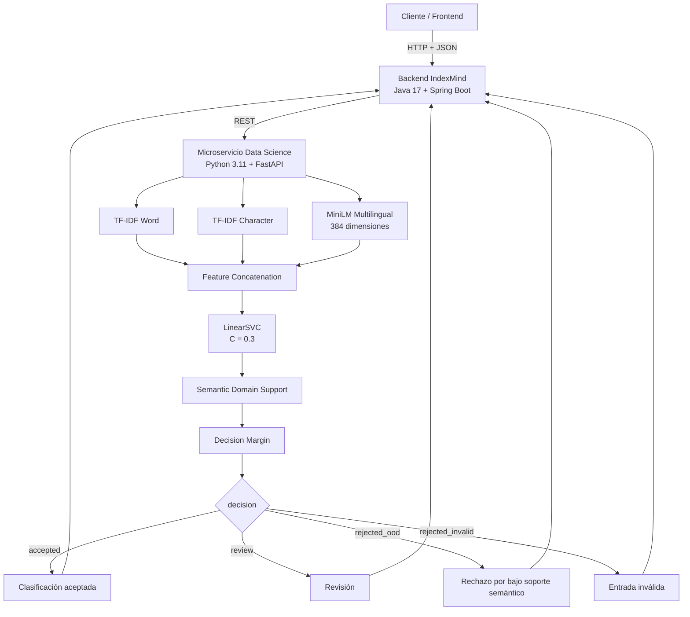

# 🚀 IndexMind

> Organización inteligente y clasificación multilingual de contenido técnico mediante una arquitectura desacoplada con **Spring Boot + FastAPI + Machine Learning híbrido**.


---

## 📌 Descripción

**IndexMind** es una solución orientada a la organización inteligente de contenido técnico mediante técnicas de Ciencia de Datos, Procesamiento de Lenguaje Natural (NLP) y Machine Learning.

Su propósito es facilitar la **clasificación, consulta y reutilización de información técnica** proveniente de documentos, artículos, cursos, tutoriales y otros materiales consumidos por estudiantes, profesionales, equipos de desarrollo y comunidades tecnológicas.

La solución utiliza una arquitectura desacoplada:

- **Backend principal:** Java 17 + Spring Boot.
- **Microservicio de Ciencia de Datos:** Python 3.11 + FastAPI.
- **Modelo multilingual:** TF-IDF Word + Character + MiniLM Multilingual + LinearSVC.
- **Contenedorización:** Docker.
- **Comunicación entre servicios:** API REST + JSON.

> **Nota de nomenclatura:** IndexMind es la solución completa. El componente de Ciencia de Datos/model serving corresponde internamente al servicio del modelo **TechMind v1.2.0-multilingual**.

---

## 📑 Tabla de contenidos

- [El problema](#️-el-problema)
- [Objetivos](#-objetivos)
- [Arquitectura del sistema](#-arquitectura-del-sistema)
- [Stack tecnológico](#️-stack-tecnológico)
- [Estructura del Monorrepositorio](#️-estructura-del-monorrepositorio)
- [Modelo multilingual](#-modelo-multilingual-v120)
- [Categorías](#️-categorías-de-clasificación)
- [Controles operativos](#️-controles-operativos-del-modelo)
- [Estados de decisión](#-estados-operativos)
- [Evaluación](#-evaluación-final-independiente)
- [Backend](#-organización-del-backend)
- [API REST](#-api-rest)
- [Docker](#-docker)
- [Quick Start](#-quick-start)
- [Logging](#-logging-recomendado)
- [Limitaciones](#️-limitaciones-conocidas)
- [Versionado y rollback](#-versionado-y-rollback)
- [Estado actual](#-estado-actual-del-proyecto)

---

# ⚠️ El problema

El crecimiento constante del contenido técnico genera grandes volúmenes de información distribuida entre documentación, tutoriales, cursos, artículos, repositorios, bases de conocimiento y materiales de capacitación.

Esto dificulta:

- encontrar información relevante rápidamente;
- mantener repositorios organizados;
- reutilizar conocimiento técnico;
- clasificar contenido de manera consistente;
- compartir información entre equipos;
- gestionar contenido en varios idiomas.

**IndexMind** busca reducir este problema automatizando la clasificación y organización de contenido técnico.

---

# 🎯 Objetivos

IndexMind busca mejorar:

### ⏱️ Optimización de tiempo

Reducir el tiempo invertido en localizar y clasificar información técnica.

### 📈 Productividad

Facilitar la recuperación y reutilización de conocimiento dentro de proyectos y equipos.

### 🤝 Colaboración

Mejorar el intercambio de conocimiento entre distintas áreas técnicas.

### 🎓 Aprendizaje continuo

Apoyar la organización de recursos utilizados en capacitación y actualización tecnológica.

### 📚 Escalabilidad

Permitir el crecimiento de repositorios de conocimiento manteniendo una estructura consistente.

### 🌐 Soporte multilingual

Clasificar contenido técnico en varios idiomas utilizando una taxonomía común.

---

# 🧱 Arquitectura del sistema

IndexMind utiliza una arquitectura desacoplada basada en servicios.



## Flujo principal

1. El usuario envía contenido técnico a IndexMind.
2. El Backend Java recibe y valida la solicitud.
3. El Backend envía el contenido al microservicio de Ciencia de Datos.
4. El microservicio genera representaciones léxicas y semánticas.
5. El modelo clasifica el contenido.
6. Se evalúa el soporte semántico dentro del dominio técnico.
7. Se evalúa el margen de decisión.
8. El microservicio devuelve una respuesta JSON estructurada.
9. El Backend interpreta el campo `decision`.
10. El resultado se entrega al cliente o se marca para revisión.

---

# 🛠️ Stack tecnológico

## 💻 Backend

- **Lenguaje:** Java 17
- **Framework:** Spring Boot
- **Gestor de dependencias:** Maven
- **IDE recomendado:** IntelliJ IDEA

### Dependencias principales

- **Spring Web:** endpoints REST y manejo de solicitudes HTTP.
- **Spring Validation:** validación declarativa de datos de entrada.
- **SpringDoc OpenAPI 2.5.0:** especificación OpenAPI 3.0 y Swagger UI.
- **Lombok:** reducción de código repetitivo.
- **Spring Boot DevTools:** soporte durante desarrollo.

## 🧪 Data Science / Machine Learning

- **Lenguaje:** Python 3.11
- **API del modelo:** FastAPI
- **Servidor ASGI:** Uvicorn
- **Machine Learning:** Scikit-Learn
- **Representación léxica:** TF-IDF
- **NLP semántico:** Sentence Transformers
- **Modelo de embeddings:** `sentence-transformers/paraphrase-multilingual-MiniLM-L12-v2`
- **Runtime de embeddings:** PyTorch CPU
- **Clasificador:** LinearSVC
- **Serialización:** Joblib
- **Análisis de datos:** Pandas / NumPy
- **Entornos de desarrollo:** Jupyter Notebook + Visual Studio Code
- **Contenedorización:** Docker

> SpaCy **no forma parte de la arquitectura final** del modelo `v1.2.0-multilingual`.

---

# 📂 Estructura del Monorrepositorio

```text
├── .env.example
├── .gitattributes
├── .gitignore
├── docker-compose.yaml
├── Dockerfile
├── mvnw
├── mvnw.cmd
├── pom.xml
├── README.md
│
├── .mvn/
│   └── wrapper/
│       └── maven-wrapper.properties
│
├── docs/
│   └── api/
│       └── openapi.yaml
│
├── modelo-ds/
│   └── techmind-v1.2-multilingual/
│       ├── deploy/
│       │   └── v1.2.0-multilingual/
│       │       ├── ARTIFACT_CERTIFICATION.md
│       │       ├── README.md
│       │       ├── requirements-v1.2.txt
│       │       ├── smoke_test_v12.py
│       │       ├── start_server.py
│       │       └── docker/
│       │           ├── compose.yaml
│       │           ├── Dockerfile
│       │           ├── Dockerfile.dockerignore
│       │           └── smoke_test_docker.py
│       │
│       ├── models/
│       │   └── experimental/
│       │       └── v1.2.0-multilingual/
│       │           └── techmind_hybrid_v1_2_0_multilingual.joblib
│       │
│       ├── techmind_api_v12/
│       │   ├── main.py
│       │   └── schemas.py
│       │
│       └── techmind_v12/
│           └── predictor.py
│
└── src/
    ├── main/
    │   ├── java/com/indexmind/api/
    │   │   ├── client/       # Cliente HTTP (ModeloDsClientV12)
    │   │   ├── config/       # Configuraciones
    │   │   ├── controller/   # ContenidoController, HealthController
    │   │   ├── dto/          # ContenidoRequest, ContenidoResponse, etc.
    │   │   ├── exception/    # Handler global de excepciones
    │   │   ├── service/      # ContenidoService, ContenidoServiceImplV12, etc
    │   │   └── util/         # TextUtils, StopWords
    │   └── resources/
    │       └── application.properties
    └── test/
        └── java/com/indexmind/api/
```

# 🧠 Modelo multilingual v1.2.0

## Versión

```text
1.2.0-multilingual
```

## Estado

```text
validated_experimental_candidate
```

El modelo v1.2 representa la evolución multilingual del baseline estable v1.1 y busca mejorar la clasificación de contenido técnico en distintos idiomas sin modificar la taxonomía principal del sistema.

## Arquitectura híbrida

El modelo combina información léxica y semántica:

1. **TF-IDF Word:** captura términos y expresiones técnicas a nivel de palabra.
2. **TF-IDF Character:** modela fragmentos, nombres de tecnologías, variantes y patrones técnicos.
3. **MiniLM Multilingual:** genera embeddings semánticos de 384 dimensiones normalizados con L2.
4. **LinearSVC:** clasifica la concatenación de todas las representaciones.

Clasificador final:

```text
LinearSVC
C = 0.3
```

Arquitectura:

```text
Texto
 │
 ├── TF-IDF Word
 ├── TF-IDF Character
 └── MiniLM Multilingual (384)
          │
          ▼
    Feature Concatenation
          │
          ▼
      LinearSVC
          │
          ▼
      Clasificación
```

El clasificador opera sobre:

```text
60,384 características
```

---

# 🌐 Soporte multilingual

| Código  | Idioma           |
| ------- | ---------------- |
| `es`    | Español          |
| `en`    | Inglés           |
| `ru`    | Ruso             |
| `es_en` | Español + Inglés |

Taxonomía común:

```text
backend
cloud
datascience
frontend
```

---

# 🏷️ Categorías de clasificación

## `backend`

APIs, servicios web, lógica de negocio, autenticación, frameworks backend, servidores y bases de datos desde la perspectiva de aplicación.

## `cloud`

Infraestructura cloud, redes, IAM, almacenamiento, serverless, observabilidad, alta disponibilidad, recuperación ante desastres, infraestructura como código y servicios administrados.

## `datascience`

Machine Learning, análisis de datos, NLP, estadística, modelos predictivos, procesamiento de datos, entrenamiento y evaluación de modelos.

## `frontend`

HTML, CSS, JavaScript, frameworks frontend, interfaces de usuario, componentes visuales e interacción cliente.

---

# 🛡️ Controles operativos del modelo

El sistema no considera válida una predicción únicamente por la categoría generada.

## 1. Semantic Domain Support

Configuración:

```text
NearestNeighbors
n_neighbors = 5
metric = cosine
```

Indicador:

```text
domain_similarity_5nn
```

Threshold interno:

```text
0.4266
```

Este control ayuda a detectar contenido fuera del dominio conocido o contenido técnico con representación insuficiente en el corpus.

> El Backend **no debe recalcular este threshold**.

## 2. Decision Margin

LinearSVC genera scores de decisión y se calcula:

```text
decision_margin = score_top1 - score_top2
```

Threshold operacional:

```text
0.8132
```

Cuando el margen es insuficiente, la clasificación se envía a revisión.

> El Backend debe utilizar `decision` y no duplicar esta lógica.

---

# 🚦 Estados operativos

Cada respuesta contiene el campo:

```json
{
  "decision": "accepted"
}
```

| `decision`         | Significado                                       | Acción del Backend                                   |
| ------------------ | ------------------------------------------------- | ---------------------------------------------------- |
| `accepted`         | Predicción aceptada                               | Puede utilizar `prediction`                          |
| `review`           | Confianza operacional insuficiente                | Mantener como provisional y enviar a revisión        |
| `rejected_ood`     | Bajo soporte semántico / posible fuera de dominio | No considerar `prediction` como clasificación válida |
| `rejected_invalid` | Entrada inválida                                  | Rechazar entrada                                     |

> **`decision` es la autoridad operacional de la respuesta.**

---

# ⚠️ Scores ≠ probabilidades

El modelo utiliza `LinearSVC`, por lo que:

```text
score_top1
score_top2
```

son **scores de decisión**, no probabilidades calibradas.

Ejemplo:

```json
{
  "score_top1": 1.62,
  "score_top2": 0.31
}
```

No significa 162 % y 31 % de confianza.

La API no debe exponerlos como `probabilidad`, `porcentaje_confianza` o equivalentes.

La decisión operacional debe basarse en:

```text
decision
decision_margin
domain_similarity_5nn
```

---

# 🧪 Evaluación final independiente

Después de congelar arquitectura, hiperparámetros y thresholds, v1.2 fue evaluado contra un benchmark multilingual independiente.

## Dataset

```text
320 documentos
80 casos semánticos
4 idiomas
4 categorías
```

Distribución:

```text
80 Inglés
80 Español
80 Español/Inglés
80 Ruso

80 Backend
80 Cloud
80 Data Science
80 Frontend
```

## Resultados globales

| Métrica         |  Resultado |
| --------------- | ---------: |
| Accuracy        | **0.7625** |
| Precision Macro | **0.8167** |
| Recall Macro    | **0.7625** |
| F1 Macro        | **0.7570** |
| F1 Weighted     | **0.7570** |

```text
244 / 320 clasificaciones correctas
```

## Resultados por idioma

| Idioma         |   Accuracy |
| -------------- | ---------: |
| Inglés         | **0.7750** |
| Español        | **0.7500** |
| Español/Inglés | **0.7875** |
| Ruso           | **0.7375** |

## Resultados por categoría

| Categoría    |   Accuracy |
| ------------ | ---------: |
| Backend      | **0.9000** |
| Cloud        | **0.4000** |
| Data Science | **0.8375** |
| Frontend     | **0.9125** |

## Desempeño operacional

Aplicando Semantic Domain Support + Decision Margin:

| Indicador         |   Resultado |
| ----------------- | ----------: |
| Accepted          |         120 |
| Review            |         160 |
| Rejected OOD      |          40 |
| Coverage          | **37.50 %** |
| Accepted Accuracy | **91.67 %** |
| Error Capture     | **86.84 %** |
| Accepted Errors   |          10 |

---

# 📊 Comparación v1.1 vs v1.2

| Modelo            |   Accuracy |   F1 Macro |
| ----------------- | ---------: | ---------: |
| v1.1              |     0.5656 |     0.5705 |
| v1.2 multilingual | **0.7625** | **0.7570** |

Mejora absoluta en Accuracy:

```text
+0.1969
≈ +19.69 puntos porcentuales
```

La mayor mejora individual se observó en contenido técnico en ruso.

---

# ⚠️ Limitaciones conocidas

## Cloud ↔ Backend

La principal limitación identificada corresponde a `cloud`.

```text
Accuracy Cloud = 0.4000
```

Una parte importante de los errores de Cloud se desplaza hacia Backend. El análisis indica que la dificultad principal está en la frontera conceptual `cloud ↔ backend` y en la cobertura del corpus.

### No corregir con reglas manuales

Backend **no debe** implementar reglas como:

```text
si contiene "AWS" → cloud
si contiene "Docker" → cloud
si contiene "API" → backend
```

Las mejoras deben realizarse en una versión futura del modelo mediante entrenamiento y validación controlada.

---

# 📦 Artefacto certificado del modelo

Ruta:

```text
models/
└── experimental/
    └── v1.2.0-multilingual/
        └── techmind_hybrid_v1_2_0_multilingual.joblib
```

SHA-256 de deployment:

```text
1a495520f642416e7dd391f97417cd3d12dcd82ab11636b7f190e5ed6dafea61
```

El artefacto contiene:

- TF-IDF Word + Character;
- `LinearSVC`;
- `C = 0.3`;
- metadata del modelo;
- `domain_reference_embeddings`;
- referencias semánticas `3666 × 384`;
- threshold OOD `0.4266`;
- threshold Decision Margin `0.8132`.

---

# 📂 Organización del Backend

```text
src
  ├───main
  │   ├───java
  │   │   └───com
  │   │       └───indexmind
  │   │           └───api
  │   │               │   IndexmindApiApplication.java
  │   │               │
  │   │               ├───client
  │   │               │
  │   │               ├───config
  │   │               │
  │   │               ├───controller
  │   │               │
  │   │               ├───dto
  │   │               │
  │   │               ├───exception
  │   │               │   │
  │   │               │   └───handler
  │   │               │
  │   │               ├───service
  │   │               │
  │   │               └───util
  │   │
  │   └───resources
  │
  └───test

```

### `controller`

Expone los endpoints públicos de IndexMind.

### `dto`

Define los modelos de request/response.

### `service`

Implementa la lógica de negocio.

### `client`

Gestiona la comunicación con el microservicio de Ciencia de Datos.

### `exception`

Manejo de excepciones y errores.

### `config`

Configuración general de la aplicación.

---

# 🔬 Microservicio de Ciencia de Datos

Endpoints internos:

```text
GET  /
GET  /health
GET  /model-info
POST /predict

GET  /docs
GET  /redoc
GET  /openapi.json
```

API:

```text
1.2.0
```

Modelo:

```text
1.2.0-multilingual
```

---

# 📡 API REST

La arquitectura distingue:

```text
Cliente
   ↓
API pública IndexMind /api/v1/...
   ↓
Backend Spring Boot
   ↓
API interna del modelo /predict
   ↓
FastAPI
```

## GET `/api/v1/health`

Permite verificar el estado de IndexMind y del servicio de Ciencia de Datos.

### Respuesta exitosa

```json
{
  "status": "ok",
  "modelo_cargado": true,
  "version": "1.2.0"
}
```

### Modelo no disponible

HTTP:

```text
503 Service Unavailable
```

```json
{
  "status": "error",
  "modelo_cargado": false,
  "version": "1.2.0"
}
```

## POST `/api/v1/contenido`

Request público:

```json
{
  "titulo": "Introducción a Spring Boot",
  "texto": "Spring Boot facilita el desarrollo de aplicaciones Java y APIs REST."
}
```

El Backend transforma la solicitud y la envía al microservicio de Ciencia de Datos.

Response:

```json
{
  "categoria": "Backend",
  "score": 0.89,
  "informacion_adicional": ["Java", "Spring Boot", "API REST"],
  "requiere_revision": false
}
```

---

# ❤️ Healthcheck del microservicio

```http
GET /health
```

Respuesta esperada:

```json
{
  "status": "ok",
  "model_loaded": true,
  "api_version": "1.2.0",
  "model_version": "1.2.0-multilingual"
}
```

El servicio debe considerarse disponible únicamente cuando:

```text
status == "ok"
AND
model_loaded == true
```

---

# 🔍 Model Info

```http
GET /model-info
```

Información relevante:

```text
model_version:
1.2.0-multilingual

status:
validated_experimental_candidate

classifier:
LinearSVC

classifier_C:
0.3

embedding_model:
sentence-transformers/paraphrase-multilingual-MiniLM-L12-v2

embedding_dimension:
384

artifact_sha256:
1a495520f642416e7dd391f97417cd3d12dcd82ab11636b7f190e5ed6dafea61

scores_are_probabilities:
false
```

---

# 📤 Clasificación de contenido

Endpoint interno:

```http
POST /predict
```

Ejemplo conceptual de respuesta:

```json
{
  "decision": "accepted",
  "prediction": "backend",
  "second_category": "cloud",
  "decision_margin": 1.24,
  "domain_similarity_5nn": 0.58,
  "reason": "accepted",
  "score_top1": 1.51,
  "score_top2": 0.27
}
```

El Backend debe decidir utilizando `decision` y no `score_top1`.

## Ejemplos por estado

### ✅ Accepted

```json
{
  "decision": "accepted",
  "prediction": "backend"
}
```

### 🟡 Review

```json
{
  "decision": "review",
  "prediction": "cloud"
}
```

### 🛑 Rejected OOD

```json
{
  "decision": "rejected_ood",
  "prediction": "backend",
  "reason": "low_domain_similarity"
}
```

### ❌ Rejected Invalid

```json
{
  "decision": "rejected_invalid",
  "prediction": null
}
```

---

# 🔎 Explicabilidad

El predictor permite solicitar información adicional:

```json
{
  "include_explanation": true,
  "explanation_top_n": 8
}
```

La explicación corresponde principalmente a la contribución diferencial de características TF-IDF.

> No debe interpretarse como una explicación completa del componente semántico MiniLM.

---

# 🐳 Docker

El microservicio está preparado para ejecutarse dentro de Docker.

La imagen utiliza:

- Python 3.11
- PyTorch CPU
- Sentence Transformers
- MiniLM Multilingual
- Scikit-Learn
- FastAPI
- Uvicorn

El modelo MiniLM se incorpora durante el build para permitir ejecución offline en runtime.

## Estructura de deployment

```text
deploy/
└── v1.2.0-multilingual/
    ├── README.md
    ├── ARTIFACT_CERTIFICATION.md
    ├── requirements-v1.2.txt
    ├── smoke_test_v12.py
    ├── start_server.py
    └── docker/
        ├── Dockerfile
        ├── Dockerfile.dockerignore
        ├── compose.yaml
        └── smoke_test_docker.py
```

---

# ⚡ Quick Start

## 1. Clonar el repositorio

```bash
git clone <URL_DEL_REPOSITORIO>
cd indexmind
```

## 2. Verificar el artefacto

Linux/macOS:

```bash
sha256sum models/experimental/v1.2.0-multilingual/techmind_hybrid_v1_2_0_multilingual.joblib
```

PowerShell:

```powershell
Get-FileHash `
  ".\models\experimental\v1.2.0-multilingual\techmind_hybrid_v1_2_0_multilingual.joblib" `
  -Algorithm SHA256
```

Debe corresponder a:

```text
1a495520f642416e7dd391f97417cd3d12dcd82ab11636b7f190e5ed6dafea61
```

## 3. Construir la imagen

```bash
docker build \
  --progress=plain \
  -f deploy/v1.2.0-multilingual/docker/Dockerfile \
  -t techmind:v1.2.0-multilingual \
  .
```

Durante el build se valida:

- PyTorch CPU;
- integridad del `.joblib`;
- carga del modelo MiniLM.

## 4. Levantar el contenedor

```bash
docker compose \
  -f deploy/v1.2.0-multilingual/docker/compose.yaml \
  up -d
```

## 5. Verificar estado

```bash
docker inspect techmind-v12 \
  --format '{{.State.Status}} / {{.State.Health.Status}}'
```

Resultado esperado:

```text
running / healthy
```

## 6. Verificar API

```bash
curl http://127.0.0.1:8000/health
```

## 7. Ejecutar smoke test

```bash
python deploy/v1.2.0-multilingual/docker/smoke_test_docker.py
```

Resultado esperado:

```text
DOCKER SMOKE TEST PASSED
```

El smoke test valida:

```text
/health
/model-info
SHA-256
/predict
English
Español
Русский
OOD
```

---

# 📖 Swagger / OpenAPI

Con el contenedor activo:

```text
http://127.0.0.1:8000/docs
```

OpenAPI JSON:

```text
http://127.0.0.1:8000/openapi.json
```

Redoc:

```text
http://127.0.0.1:8000/redoc
```

---

# 📋 Logging recomendado

Registrar por predicción:

```text
timestamp
model_version
decision
prediction
second_category
decision_margin
domain_similarity_5nn
reason
latency_ms
```

Opcional:

```text
tfidf_active_features
```

> Evitar almacenar el texto completo cuando pueda contener información sensible.

---

# 🔄 Versionado y rollback

## v1.1.0

```text
stable baseline / fallback
```

## v1.2.0-multilingual

```text
validated experimental candidate
```

La versión v1.1 debe conservarse como fallback mientras v1.2 permanece como candidato principal de integración y demostración.

---

# ⛔ Backend no debe modificar

El Backend no debe modificar ni duplicar la lógica de:

```text
LinearSVC C = 0.3

OOD threshold = 0.4266

Decision Margin threshold = 0.8132

MiniLM embedding model

Semantic Domain Support

Clases:
backend
cloud
datascience
frontend

Estados:
accepted
review
rejected_ood
rejected_invalid
```

Cualquier cambio debe corresponder a una nueva versión controlada del modelo.

---

# 🔐 Integridad del artefacto

Artefacto de deployment:

```text
techmind_hybrid_v1_2_0_multilingual.joblib
```

SHA-256:

```text
1a495520f642416e7dd391f97417cd3d12dcd82ab11636b7f190e5ed6dafea61
```

El Dockerfile valida este SHA durante el build mediante `sha256sum`.

Si el checksum no coincide, el build debe detenerse para evitar desplegar un artefacto incorrecto, incompleto, corrupto o no certificado.

---

# ✅ Estado actual del proyecto

| Componente                           | Estado |
| ------------------------------------ | ------ |
| Modelo multilingual                  | ✅     |
| Español                              | ✅     |
| Inglés                               | ✅     |
| Ruso                                 | ✅     |
| Español/Inglés                       | ✅     |
| TF-IDF Word + Character              | ✅     |
| MiniLM Multilingual                  | ✅     |
| LinearSVC                            | ✅     |
| Semantic Domain Support              | ✅     |
| Decision Margin                      | ✅     |
| FastAPI                              | ✅     |
| OpenAPI                              | ✅     |
| Artefacto Joblib                     | ✅     |
| SHA-256 deployment                   | ✅     |
| Docker                               | ✅     |
| PyTorch CPU                          | ✅     |
| Healthcheck                          | ✅     |
| `/model-info`                        | ✅     |
| `/predict`                           | ✅     |
| Smoke Test Docker                    | ✅     |
| Benchmark multilingual independiente | ✅     |

---

# 🧭 Roadmap

Próximas mejoras propuestas:

- mejorar la frontera conceptual `cloud ↔ backend`;
- ampliar el corpus técnico multilingual;
- crear un nuevo benchmark independiente para una futura v1.3;
- analizar calibración de confianza;
- mejorar explicabilidad del componente híbrido;
- fortalecer observabilidad y métricas de producción;
- automatizar CI/CD del contenedor;
- preparar despliegue productivo en OCI.

---

# 📌 Resumen de versión

```text
Proyecto:
IndexMind

Model Service:
TechMind

API:
1.2.0

Modelo:
1.2.0-multilingual

Estado:
validated_experimental_candidate

Clasificador:
LinearSVC

C:
0.3

Embeddings:
paraphrase-multilingual-MiniLM-L12-v2

Dimensión:
384

SHA-256 deployment:
1a495520f642416e7dd391f97417cd3d12dcd82ab11636b7f190e5ed6dafea61
```

---

## 👥 Equipo

Proyecto desarrollado como parte de un trabajo colaborativo orientado a la clasificación inteligente y organización de contenido técnico.

---

## 📄 Licencia

Agregar aquí la licencia definida por el equipo para el repositorio.
